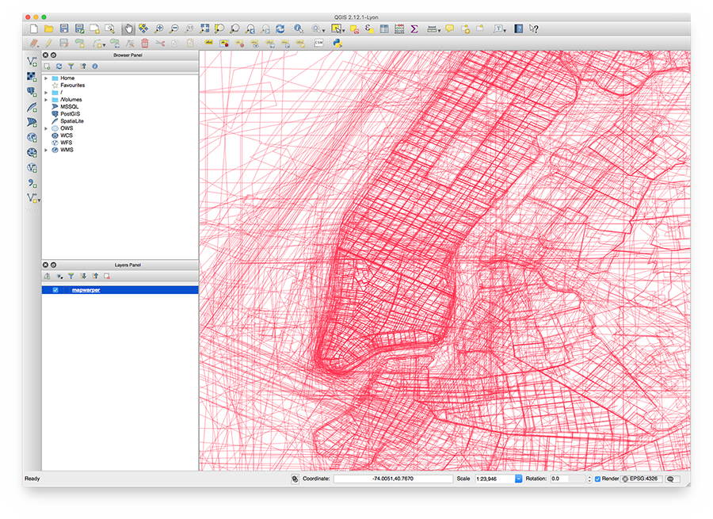

# NYC Space/Time Directory - Maps by Decade

__Visit [Maps by Decade](http://spacetime.nypl.org/maps-by-decade)!__

Maps by Decade shows New York City street maps from the New York Public Library's [Lionel Pincus and Princess Firyal Map Division](https://www.nypl.org/about/divisions/map-division), grouped by decade.

Maps by Decade shows more than 5,000 large-scale maps (i.e. maps depicting an area smaller than 5 km²) of New York City that are digitized, georectified, and in the public domain (or of which the Library holds the copyright). You can browse 20,000 more maps and atlases in NYPL's [Digital Collections](http://digitalcollections.nypl.org/), the Library's database of its digitized collections. Or visit [Map Warper](http://maps.nypl.org/warper), our online tool for rectifying public domain maps.

For more information, see Map by Decade's [About page](http://spacetime.nypl.org/maps-by-decade/#about).

## NYC Space/Time Directory

Maps by Decade is part of the [NYC Space/Time Directory](http://spacetime.nypl.org/). The goal of this project is to&mdash;through a variety of resources&mdash;unlock the potential of historical maps and provide opportunities to explore urban history across space and time.

Major support for the NYC Space/Time Directory is provided by the [Knight News Challenge](http://www.knightfoundation.org/grants/6715), an initiative of the [John S. and James L. Knight Foundation](http://www.knightfoundation.org/).

## Technology

Maps by Decade is built using the following open source projects:

- __[Leaflet](http://leafletjs.com/)__: JavaScript library for interactive maps
- __[Leaflet.Sync](https://github.com/turban/Leaflet.Sync)__: synchronized panning and zooming for Leaflet maps
- __[RBush](https://github.com/mourner/rbush)__: JavaScript R-tree-based 2D spatial index for points and rectangles
- __[Turf](http://turfjs.org/)__: geospatial analysis and algorithms for JavaScript
- __[`react-boilerplate`](https://github.com/react-boilerplate/react-boilerplate)__: I like React and Redux and webpack but I'm not smart enough to set up my own project and combine everything together. `react-boilerplate` does this for me. It has 10,000 dependencies and seems a bit too complicated, but maybe there's no way around that.

## Data

Maps by Decade makes the Library's collection of digitized and georectified historical maps more accessible by displaying their outlines on a map of modern-day New York City.

In NYPL's [Map Warper](http://maps.nypl.org/warper/), maps are both rectified and cropped:

1. [Map rectification](http://maps.nypl.org/warper/maps/15640#Rectify_tab): placing control points on the original map and on OpenStreetMap
2. [Map cropping](http://maps.nypl.org/warper/maps/15640#Crop_tab): selecting and removing non-cartographic areas on the original map

Each map for which this is done is available via [Map Warper's API](http://maps.nypl.org/warper/maps.json). Data from Map Warper will appear in Maps by Decade through the following steps:

1. [Space/Time's ETL tool](https://github.com/nypl-spacetime/spacetime-etl) (Extract, Transform, Load) is used to run [`etl-mapwarper`](https://github.com/nypl-spacetime/etl-mapwarper):
    - This ETL module reads all maps from Map Warper's API and converts them to an [NYC Space/Time Directory dataset](http://spacetime.nypl.org/#data-mapwarper)
    - `etl-mapwarper` uses [mask-to-geojson](https://github.com/nypl-spacetime/mask-to-geojson ) to convert the outlines of cropped maps to GeoJSON
2. Another ETL module, [`etl-group-maps`](https://github.com/nypl-spacetime/etl-group-maps) is executed; this module processes Space/Time's Map Warper dataset, groups all maps by decade, and uses [Turf](http://turfjs.org/) to compute the geospatial union per decade
3. The two resulting GeoJSON files are published on Amazon S3 (and served via Amazon CloudFront):
    - [`maps-by-decade.all.json`](http://s3.amazonaws.com/spacetime-nypl-org/datasets/group-maps/maps-by-decade.all.json)
    - [`maps-by-decade.grouped.json`](http://s3.amazonaws.com/spacetime-nypl-org/datasets/group-maps/maps-by-decade.grouped.json)

Screenshot of Maps by Decade data, visualized with QGIS:

## Installation

To run Maps by Decade locally, first clone this repository:

    git clone https://github.com/nypl-spacetime/maps-by-decade.git
    cd maps-by-decade

Then, install all dependencies:

    npm install

To start Maps by Decade, run:

    npm run start-no-local-data

Maps by Decade is now running on [localhost:3223](http://localhost:3223/)!

By running `start-no-local-data`, Maps by Decade will load its data from Amazon CloudFront.

It's also possible to serve Maps by Decade's data files locally. To do this, run:

    npm start

Then, by default, Maps by Decade expects its two data files (e.g. `maps-by-decade.all.json` and `maps-by-decade.grouped.json`) to be available on http://group-maps-data.dev/, but you can change this by editing [`config/default.yml`](config/default.yml).

To use the `.dev` domain, Maps by Decade uses [Hotel](https://github.com/typicode/hotel). Install Hotel:

    npm install -g hotel && hotel start

Install [http-server](https://github.com/indexzero/http-server):

    npm install http-server -g

Download Maps by Decade's data files:

    mkdir group-maps-data
    cd group-maps-data
    wget http://s3.amazonaws.com/spacetime-nypl-org/datasets/group-maps/maps-by-decade.all.json
    wget http://s3.amazonaws.com/spacetime-nypl-org/datasets/group-maps/maps-by-decade.grouped.json

Add a Hotel dev server in the `group-maps-data` directory, with CORS enabled:

    hotel add 'http-server -p $PORT --cors'

Now, the Maps by Decade data files are available on http://group-maps-data.dev/.

It's also possible to use [Space/Time's ETL tool](https://github.com/nypl-spacetime/spacetime-etl) to fetch Map Warper data and compute Maps by Decade data yourself:

- [See GitHub for instructions](https://github.com/nypl-spacetime/spacetime-etl) how to install and use the ETL tool
- Install the following two ETL modules:
    1. [`etl-mapwarper`](https://github.com/nypl-spacetime/etl-mapwarper)
    2. [`etl-group-maps`](https://github.com/nypl-spacetime/etl-group-maps)
- Run both ETL modules:
    1. `spacetime-etl mapwarper`
    2. `spacetime-etl group-maps`

To build Maps by Decade, run:

    npm run build

The `build` directory will now contain HTML, JS, CSS and image files you can distribute.
